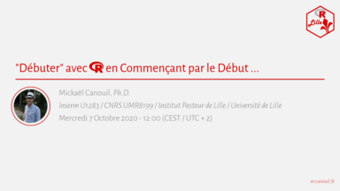

Bonjour à toutes et tous,
 
R Lille (le groupe des utilisateurs de R) organise son premier MeetUp :  
**"Débuter" avec R en Commençant par le Début ...**

Celui-ci aura lieu le **Mercredi 7 Octobre à 12 h 00** dans **l’Amphithéâtre D (aile Ouest) de la Faculté de Médecine de Lille (Pôle Recherche)**.

Les inscriptions sont par ici : https://www.meetup.com/R-Lille/events/273159362/  
Ce MeetUp n'est ouvert qu'à **30 participants**.  
L'ensemble des diapositives sera mis à disposition sur le GitHub du groupe : https://github.com/RLille/meetups

> Vous souhaitez démarrer avec de bonnes bases ?  
> Vous suspectez que vous n'avez pas que des bonnes pratiques/habitudes ?  
> Vous aimeriez améliorer ou modifier votre pratique de R, pour être plus efficace et plus autonome ?  
> Vous ignorez ce que sont les fichiers `.Rdata`, `.rds`, `.R`, `.Rmd`, `.Renviron` et/ou `.Rprofile` ?  
> Vous maitrisez les commandes `rm(list = ls())` et `setwd()` ?
>
> Ce premier MeetUp vise à donner quelques trucs et astuces autour de R et de l'IDE Rstudio, ainsi qu'ouvrir la discussion sur quelques "règles/conventions" de bonnes pratiques dans un objectif de reproductibilité.
>
> Lieu : Faculté de Médecine de Lille - Pôle Recherche - Amphithéâtre D (aile Ouest)

À bientôt !  
Mathilde BOISSEL, Julien HAMONIER et Mickaël CANOUIL