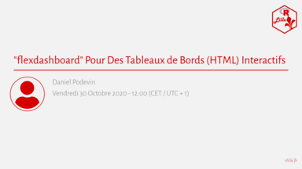

Bonjour à toutes et tous,
 
R Lille (le groupe des utilisateurs de R) organise son second MeetUp :  
**'flexdashboard' Pour Des Tableaux de Bords (HTML) Interactifs**

> '[flexdashboard](https://rmarkdown.rstudio.com/flexdashboard/index.html)' permet la réalisation de tableau de bords statiques ou dynamiques ('Shiny') au moyen d'une structure en grille définie dans un script Rmarkdown.

Celui-ci est proposé par **Daniel Podevin** et aura lieu le **Vendredi 30 Octobre à 12 h 30** dans **l’Amphithéâtre D (aile Ouest) de la Faculté de Médecine de Lille (Pôle Recherche)**.

Les inscriptions sont par ici :

* En ligne : https://www.meetup.com/R-Lille/events/273921614/
* En présentiel : https://www.meetup.com/R-Lille/events/274033022/

L'ensemble des diapositives sera mis à disposition sur le GitHub du groupe : https://github.com/RLille/meetups

À bientôt !  
Mathilde BOISSEL, Julien HAMONIER et Mickaël CANOUIL