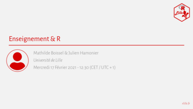

Bonjour à toutes et tous,

Pour ce premier MeetUp 2021, nous vous proposons une réunion orientée sur l'**enseignement** et comment **R** peut y être utilisé. 

Nous avons en tête un moment d'échange sur vos pratiques, méthodes, outils, etc., **plutôt en mode discussion que présentation**. 

Si vous enseignez du R ou que vous utilisez ce langage pour construire vos cours et que vous aimeriez partager/discuter de votre expérience, inscrivez-vous !

Ce MeetUp aura lieu en ligne (via **Zoom**), le **Mercredi 17 Février à 12 h 30**.

Les inscriptions sont par ici : http://meetup.rlille.fr/events/276325926/

L'ensemble des diapositives sera mis à disposition sur le GitHub du groupe : https://github.com/RLille/meetups

À bientôt !  
Mathilde BOISSEL et Julien HAMONIER