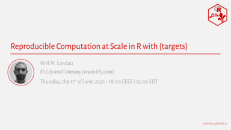

Bonjour à toutes et tous,
 
R Lille  organise un nouveau MeetUp sur le thème de la reproductibilité des analyses :  
**Reproducible Computation at Scale in R with {targets}**

<iframe width="560" height="315" src="https://www.youtube.com/embed/FODSavXGjYg" title="YouTube video player" frameborder="0" allow="accelerometer; autoplay; clipboard-write; encrypted-media; gyroscope; picture-in-picture" allowfullscreen></iframe>

<!-- 
 -->
<!--  -->
<!-- 
 -->
  
  
> _[Résumé]_  
> L'extension R {targets} (https://docs.ropensci.org/targets/) améliore la reproductibilité, la mise à l'échelle et la maintenabilité des projets de science des données dans des domaines utilisants des méthodes de calcul intensif tels que l'apprentissage automatique, l'analyse de données bayésiennes et la statistique génomique. 
> {targets} identifie la structure de dépendance des éléments du pipeline d'analyse, ignore les tâches à jour, exécute le reste et gère le stockage des données, tout en offrant des options de calcul distribué.
> {stantargets} (https://docs.ropensci.org/stantargets/) et extensions similaires, étendent {targets} pour simplifier la construction de pipelines pour des domaines d'application spécifiques, tels que la validation de modèles bayésiens.
> 
> _[Bio]_  
> Will Landau (https://wlandau.github.io/) travaille pour Eli Lilly and Company (https://www.lilly.com/) où il développe des méthodes et des outils pour les statisticiens/cliniciens.
> Il est le créateur et le mainteneur des extensions R {targets} et {drake}.
> Will a obtenu son doctorat en statistique à l'Université d'État de l'Iowa en 2016, durant laquelle il a appliqué des méthodes bayésiennes, des modèles hiérarchiques et réalisé du calcul GPU dans le cadre d'analyse de données RNA-seq.
> 
> _[A Propos]_  
> Cet événement est organisé par R Lille (Lille, France) et aura lieu en anglais.

Celui-ci sera présenté par **Will Landau** sur invitation de __R Lille__ et aura lieu le **jeudi 17 juin 2021 à 18 h 00 (CEST / UTC + 2)** en ligne.

Les inscriptions sont sur Meetup : http://meetup.rlille.fr/events/277902715/

L'ensemble des diapositives sera mis à disposition sur le GitHub du groupe : https://github.com/RLille/meetups

Le Meetup sera enrigistré et diffusé sur Youtube (http://youtube.rlille.fr/).

À bientôt !  
Mickaël CANOUIL