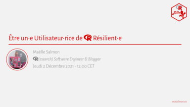

Bonjour à toutes et tous,
 
R Lille organise un nouveau MeetUp :  
**Être un•e utilisateur•rice de R résilient•e**

<iframe width="560" height="315" src="https://www.youtube.com/embed/Jt0-x_w1Rzw" title="YouTube video player" frameborder="0" allow="accelerometer; autoplay; clipboard-write; encrypted-media; gyroscope; picture-in-picture" allowfullscreen></iframe>

<!-- 

 -->
  
> _[Résumé]_  
> Apprendre R est une excellente idée pour réaliser différentes tâches au travail.  
> Cependant, même une fois passé·e au-delà de "Bonjour Monde", vous continuerez régulièrement à avoir des problèmes dans R ...  
> Triste constat ? Non, car vous apprendrez aussi à devenir un·e utilisateur·rice de R résilient·e !
> 
> _[Bio]_  
> Maëlle Salmon ([https://masalmon.eu/](https://masalmon.eu/)), docteure en statistique, travaille avec R depuis des années.  
> Elle essaie tant bien que mal de suivre ses propres conseils pour ne pas se laisser décourager par des erreurs. :-)  
> Elle est ingénieure de programmation pour la recherche à temps partiel pour [rOpenSci](https://ropensci.org/), et réalise d'autres missions souvent en lien avec le développement de paquets. 
> Elle a par exemple crée le [blog R-hub](https://blog.r-hub.io/).  
> Par ailleurs, elle est éditrice bénévole pour le système de revue de paquets de [rOpenSci](https://ropensci.org/) et gère le compte Twitter de [R-Ladies Global](https://twitter.com/RLadiesGlobal).
> 
> _[A Propos]_  
> Cet événement est organisé par [R Lille](https://rlille.fr) (Lille, France) et aura lieu en français.

Celui-ci sera présenté par **Maëlle Salmon** ([https://masalmon.eu/](https://masalmon.eu/)) sur invitation de __R Lille__ et aura lieu le **jeudi 2 décembre 2021 à 12 h 00 (CET / UTC + 1)** en ligne.

Les inscriptions sont sur Meetup : http://meetup.rlille.fr/events/281225809/

L'ensemble des diapositives sera mis à disposition sur le GitHub du groupe : https://github.com/RLille/meetups

Le Meetup sera enrigistré et diffusé sur Youtube (http://youtube.rlille.fr/).

À bientôt !  
Mickaël CANOUIL