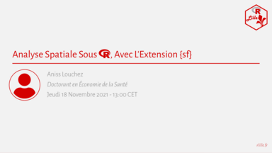

Bonjour à toutes et tous,
 
R Lille organise un nouveau MeetUp sur le thème :  
**Analyse Spatiale Sous R, Avec L'Extension {sf}**

<iframe width="560" height="315" src="https://www.youtube.com/embed/NSbnWCjTfGk" title="YouTube video player" frameborder="0" allow="accelerometer; autoplay; clipboard-write; encrypted-media; gyroscope; picture-in-picture" allowfullscreen></iframe>

<!-- 

 -->
  
> _[Résumé]_  
> Bien qu'initialement non conçus spécifiquement pour l'analyse spatiale, un certain nombre de packages ont émergé sur le logiciel R.  
> Les trois principaux sont {rgdal} qui permettait d'importer des données spatiales (shapefile, ...), {sp} qui fournit les outils pour analyser les données, les mettre en formes, etc.,  et {rgeos} qui permet les opérations de > SIG classique (calculs de distances, calculs de périmètre, intersection, etc.).
> 
> Le package {sf} pour "simple feature" est un package de simplification. 
> Il permet d'exploiter tous les types de données spatiales que ce soit des analyses de points, des découpages administratifs ou encore des grilles. 
> Grâce à sa panoplie rationalisée de fonction, il permet avec un minimum de fonctions d'importer/exporter, de manipuler/traiter les données et de les présenter de façon simple. 
> Et tout cela en un seul package au lieu de trois auparavant!
> 
> À cela s'ajoute sa syntaxe claire et normée, ainsi toutes ses fonctions commençant par "st_" sont faciles à retrouver.
> 
> Si le format des données peut paraître complexe au premier abord, il interagit facilement avec d'autres packages. 
> Ainsi, la sélection d'observation est facilitée avec le package {dplyr} et la visualisation des données est aisée via "ggplot".
> 
> _[Bio]_  
> Aniss Louchez est doctorant en économie de la santé sur la thématique de l'intégration territoriale, sociale et économique des officines.
> 
> _[A Propos]_  
> Cet événement est organisé par R Lille (https://rlille.fr/) (Lille, France) et aura lieu en français.

Celui-ci sera présenté par **Aniss Louchez** et aura lieu le **jeudi 18 novembre 2021 à 13 h 00 (CET / UTC + 1)** en ligne.

Les inscriptions sont sur Meetup : http://meetup.rlille.fr/events/281653108/

L'ensemble des diapositives sera mis à disposition sur le GitHub du groupe : https://github.com/RLille/meetups

Le Meetup sera enrigistré et diffusé sur Youtube (http://youtube.rlille.fr/).

À bientôt !  
Julien Hamonier