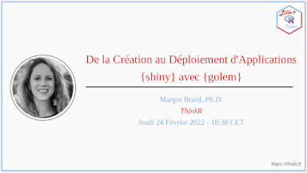

Bonjour à toutes et tous,
 
R Lille organise un nouveau MeetUp sur le thème :  
**De la Création au Déploiement d'Applications {shiny} avec {golem}**

<!-- 

<iframe width="560" height="315" src="https://www.youtube.com/embed/" title="YouTube video player" frameborder="0" allow="accelerometer; autoplay; clipboard-write; encrypted-media; gyroscope; picture-in-picture" allowfullscreen></iframe>

 -->

  
> \[Résumé\]  
> Vous souhaitez construire un application Shiny en suivant les meilleures
> pratiques de développement ? Alors le package {golem} est ce qu’il vous
> faut. Grâce à {golem}, chaque application Shiny est un… package 📦 ! Cela
> vous permettra de faciliter la création de votre application, en
> automatisant les tâches ~~ennuyantes~~ répétitives par lesquelles vous
> devrez nécessairement passer. Cela vous permettra aussi de faciliter son
> déploiement et d’assurer sa durabilité, en développant un code documenté
> et testé 🎉.
> 
> \[Biographie\]  
> Margot Brard (<https://github.com/MargotBr>), docteure en statistique
> appliquée, est consultante et formatrice R chez ThinkR
> (<https://rtask.thinkr.fr/> et <https://thinkr.fr>).  
> Elle y forme des apprenants à l’utilisation de R pour l’analyse de
> données et au développement de packages. Elle participe également au
> développement de packages R pour différents clients (entreprises
> privées, institutions publiques, etc.).  
> Elle est la lauréate de l’édition 2021 du Shiny Contest
> (<https://blog.rstudio.com/2021/06/24/winners-of-the-3rd-annual-shiny-contest/>).
> Au grand désespoir de son mari - *qui l’a trouvée un peu trop geek sur
> ce coup* - elle a développé avec {golem} une app Shiny pour leur mariage
> : {wedding} (<https://github.com/ThinkR-open/wedding>).
> 
> \[A Propos\]  
> Cet événement est organisé par les groupes R de Lille
> (<https://rlille.fr/>) et Tunis.  
> La langue du Meetup est le français.  
> Le Meetup sera enregistré et rendu disponible sur YouTube.
> 
> \[Inscription\]  
> Pour assister au Meetup, veuillez remplir ce court formulaire :
> <https://tinyurl.com/y3avzb9s>  
> Le lien Zoom sera envoyé par courriel après inscription et quelques
> jours avant le début du Meetup.
> 
> \[Média Sociaux\]  
> 
> - Meetup : 
>   - <https://www.meetup.com/tunis-r-user-group
>   - <https://www.meetup.com/RLille
> 
> - Twitter :
>     - https://twitter.com/TunisRUserGroup
>     - https://twitter.com/RLille_RUG

Celui-ci sera présenté par **Margot Brard, Ph.D.** et aura lieu le **jeudi 24 février 2022 à 18 h 30 (CET / UTC + 1)** en ligne.

Les inscriptions sont sur Meetup : http://meetup.rlille.fr/events/283419297/

L'ensemble des diapositives sera mis à disposition sur GitHub : [https://github.com/Tunis-R-User-Group/Lille-Tunis-Meetups](https://github.com/Tunis-R-User-Group/Lille-Tunis-Meetups/tree/main/meetups/2022-02-24/materials)

Le Meetup sera enrigistré et diffusé sur Youtube (http://youtube.rlille.fr/).

À bientôt !  
Mickaël Canouil